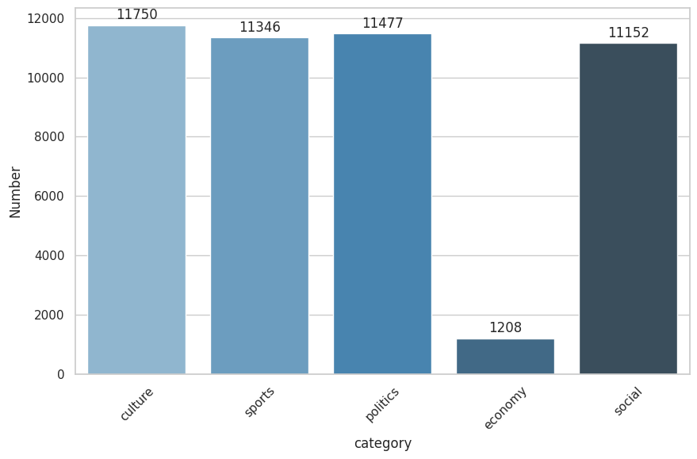

# Persian News Article Classification
Based on the article

ITRC, IRAN, Tehran

---
Corpus
---

This project involves the collection of two datasets: one from Fars News and the other from Tasnim.

Description of the Fars News Dataset :

|  category    |   Number   |     
|--------------|------------|
| culture      | 6000       |
| sports       | 5999       |
| politics     | 5994       |
| economy      | 5992       |
| social       | 5991       |

Description of the Tasnim Dataset :

|  category    |   Number   |     
|--------------|------------|
| culture      | 5750       |
| sports       | 5347       |
| politics     | 5483       |
| economy      | 6095       |
| social       | 5161       |

Aggregated dataset used :

