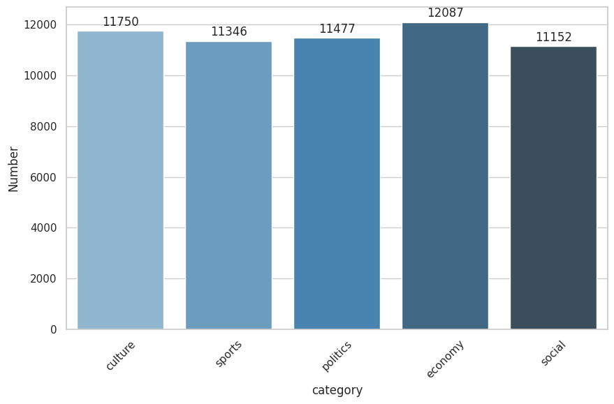
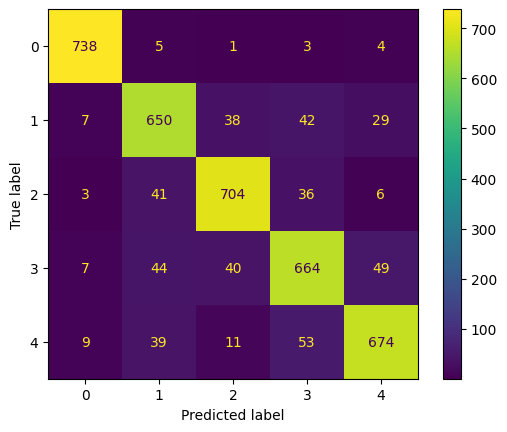

# Persian News Article Classification
Based on the article

ITRC, IRAN, Tehran

---
Corpus
---

This project involves the collection of two datasets: one from Fars News and the other from Tasnim.

Description of the Fars News Dataset :

|  category    |   Number   |     
|--------------|------------|
| culture      | 6000       |
| sports       | 5999       |
| politics     | 5994       |
| economy      | 5992       |
| social       | 5991       |

Description of the Tasnim Dataset :

|  category    |   Number   |     
|--------------|------------|
| culture      | 5750       |
| sports       | 5347       |
| politics     | 5483       |
| economy      | 6095       |
| social       | 5161       |

Aggregated dataset used :

---
Deep Learning Models
---

Two Deeo Learning Pretrain model have  been experimented:

|  category    | Precision  | Accuracy   |    
|--------------|------------|------------|
| ParsBERT: Transformer-based Model for Persian Language Understanding     | 0.85       |0.83     |
| Language-agnostic BERT Sentence Embedding (LaBSE)       | 0.85       |0.84       |

---
Evaluation (Confusion matrix)
---
Confusion matrix using the best model ParsBERT:

|  category    | label  |
|--------------|------------|
| culture      | 0       |
| economy      | 1       |
| politics     | 2       |
| social       | 3       |
| sports       | 4       |

---
Team mate
---

Dr Marjan Godarzi

Dr Elham Ghasemi

Dr Gholshid Ranjbaran

[Mr Alireza Parvaresh](https://www.linkedin.com/in/parvvaresh/)

[Faezeh Gholamrezaie](https://github.com/faezeh-gholamrezaie)
    
